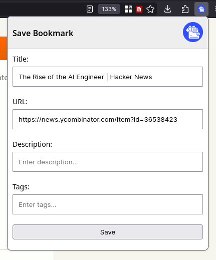
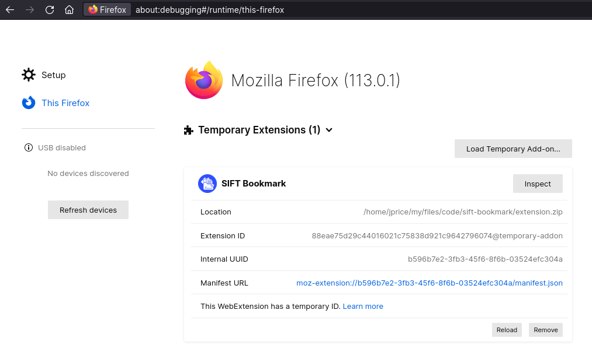

# SIFT - Save Bookmark Firefox Addon

This is a Firefox Desktop and Firefox for Android extension/add-on that gets the title, URL and description (if it exists) of the current webpage. It sends that data to SIFT (which is my personal organisation and knowledge base). It's almost entirely useless to everyone but me!

It's also worth noting, that the main functionality has been almost entirely written by ChatGPT.



## Testing

### Firefox Desktop

It's really easy to test on Firefox for Android.

```sh
# Zip the directory contents:
zip extension.zip *
```

In Firefox go to `about:debugging#/runtime/this-firefox` and click on "Load Temporary Add-on...". After any changes, just zip the directory up again, and click "Reload".



### Firefox for Android

It's actually _really_ easy to test the extension on Firefox for Android, more details [here](https://extensionworkshop.com/documentation/develop/developing-extensions-for-firefox-for-android/#install-and-run-your-extension-in-firefox-for-android) but effectively install [web-ext]() and then run the below command from within this directory. If you need anything else `web-ext` will tell you.

```sh
web-ext run -t firefox-android --adb-device <device-id> --firefox-apk org.mozilla.fenix
```

The above command will open Firefox for Android, and install the add-on. Anytime you change something, it'll reload it almost instantly. Quite impressive and makes it very easy to test.

## Installation

### Firefox Desktop

It can be installed on Firefox desktop from the Firefox Add-ons store [here](https://addons.mozilla.org/en-GB/firefox/addon/sift-save-bookmark/).

### Firefox for Android

Follow the instructions [here](https://blog.mozilla.org/addons/2020/09/29/expanded-extension-support-in-firefox-for-android-nightly/).

## Acknowledgements

- SIFT Icon (<a href="https://www.flaticon.com/free-icon/documentation_9746449?term=document&related_id=9746449" title="document icons">Document icons created by Awicon - Flaticon</a>)

